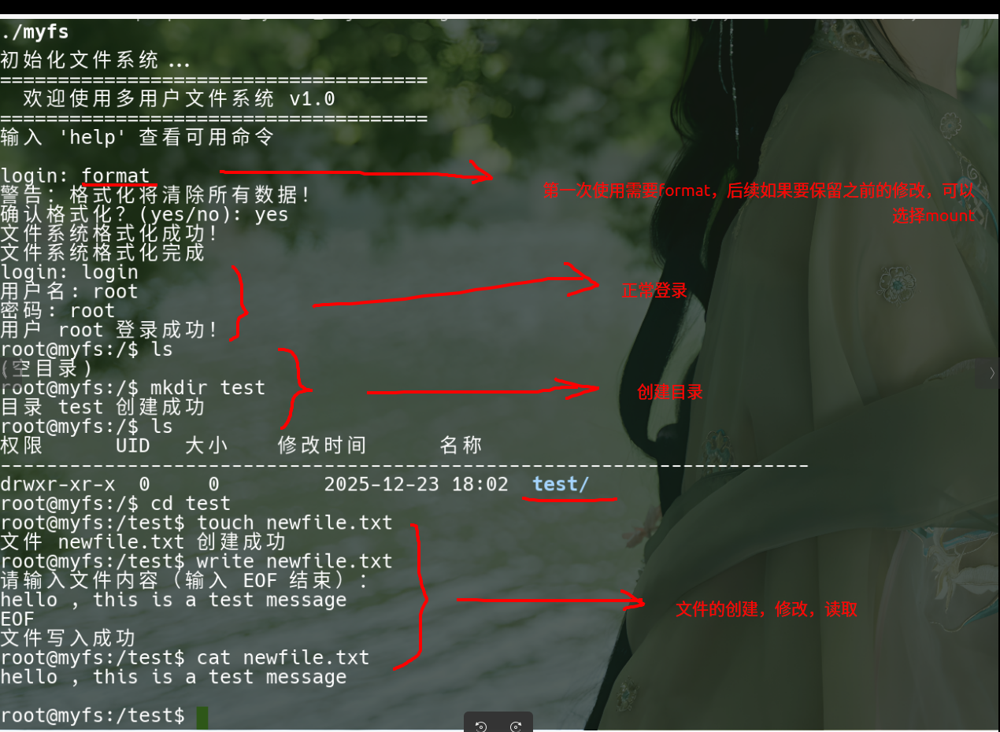
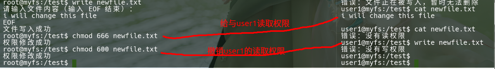
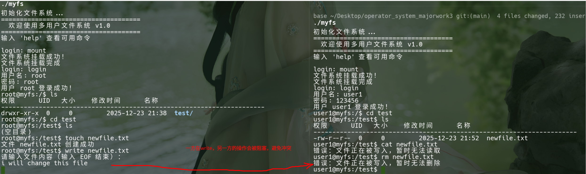

# 多用户文件系统课程设计

一个基于 C++ 实现的多用户文件系统，模拟 Linux 文件系统的核心功能，包含用户管理、权限控制、文件操作和并发控制等特性。

## 项目特性

### 1. 核心功能
- ✅ **文件系统基础结构**
  - 超级块 (Super Block)：记录文件系统元数据
  - i 节点 (Inode)：存储文件/目录的元信息
  - 目录项 (Directory Entry)：文件名与 Inode 的映射
  - 位图 (Bitmap)：管理 Inode 和数据块的分配
  - 虚拟磁盘：10MB 的虚拟磁盘文件 (disk.bin)

### 2. 多用户系统
- ✅ **用户管理**
  - 支持多用户登录/登出
  - 默认用户：root (超级管理员), user1, user2
  - 基于 UID 的用户识别

- ✅ **权限控制**
  - 类 Unix 的 rwx 权限系统（所有者/组/其他）
  - 支持 chmod 修改权限
  - 支持 chown 修改所有者（仅 root）
  - 默认权限：目录 755, 文件 644

### 3. 文件操作
- ✅ **基本命令**
  - `mount` - 挂载文件系统，它会读取用户表，载入文件系统，是文件系统正常使用的前提
  - `format` - 格式化，会删除所有文件和用户表，并载入一个全新的文件系统，你可以理解成手机的恢复出厂设置，适用于第一次启动，或者出现某些无法解决的问题时使用
  - `ls` - 列出目录内容
  - `cd` - 切换目录
  - `pwd` - 显示当前路径
  - `mkdir` - 创建目录
  - `touch` - 创建文件
  - `rm` - 删除文件
  - `rmdir` - 删除目录
  - `cat` - 查看文件内容
  - `write` - 写入文件内容

### 4. 并发控制
- ✅ **读写锁机制**
  - 读读允许：多个用户可同时读取同一文件
  - 读写互斥：读和写操作互相排斥
  - 写写互斥：写操作之间互相排斥
  - 基于 mutex 和 condition_variable 实现

### 5. 用户界面
- ✅ **友好的 Shell 界面**
  - 类 Linux 终端的命令行界面
  - 彩色输出（目录显示为蓝色）
  - 详细的文件信息显示
  - 错误提示和帮助信息

## 项目结构

```
operator_system_majorwork3/
├── filesystem.h        # 文件系统核心数据结构定义
├── filesystem.cpp      # 文件系统核心功能实现
├── shell.h            # Shell 命令解析器头文件
├── shell.cpp          # Shell 命令解析器实现
├── main.cpp           # 主程序入口
├── Makefile           # 编译配置
├── README.md          # 项目说明文档
└── disk.bin           # 虚拟磁盘文件（运行后生成）
```

## 快速开始

### 环境要求
- Linux 系统（推荐 Ubuntu/Debian）
- GCC/G++ 支持 C++11 及以上
- pthread 库

### 编译项目
```bash
make
```

### 运行程序
```bash
./myfs
```


## 使用指南

### 1. 首次使用

启动程序后，需要先格式化文件系统：

```bash
format              # 格式化文件系统
mount               # 挂载文件系统
login               # 登录用户
```

**默认用户账号：**
- root / root (超级管理员)
- user1 / 123456
- user2 / 123456

### 2. 常用命令示例

```bash
# 查看帮助
help

# 用户登录
login
# 输入用户名: root
# 输入密码: root

# 创建目录和文件
mkdir documents
cd documents
touch readme.txt

# 写入文件内容
write readme.txt
# 输入内容，输入 EOF 结束

# 查看文件
cat readme.txt

# 列出文件（详细信息）
ls

# 修改权限
chmod 755 readme.txt

# 查看系统信息
info

# 退出
exit
```


### 3. 权限说明

权限使用八进制表示，类似 Linux：
- `7` = rwx (读、写、执行)
- `6` = rw- (读、写)
- `5` = r-x (读、执行)
- `4` = r-- (只读)

例如：
- `755` = rwxr-xr-x (所有者全部权限，其他人读和执行)
- `644` = rw-r--r-- (所有者读写，其他人只读)

## 技术实现细节

### 1. 数据结构设计

**超级块 (SuperBlock)**
- 存储在磁盘的第 0 块
- 记录文件系统的全局信息
- 包含魔数用于识别文件系统

**Inode**
- 每个 Inode 128 字节
- 支持 10 个直接块指针和 1 个间接块指针
- 存储文件类型、权限、所有者、时间戳等信息

**目录项 (DirectoryEntry)**
- 32 字节结构
- 包含文件名（28字节）和 Inode 编号（4字节）

### 2. 磁盘布局

```
[超级块] [Inode位图] [数据块位图] [Inode表] [数据块区域]
 Block0    Block1      Block2      Block3+      ...
```

### 3. 并发控制实现

使用 `OpenFileEntry` 结构管理打开的文件：
- `reader_count`: 当前读者数量
- `is_writing`: 是否有写者
- `mutex`: 保护锁
- `condition_variable`: 条件变量

**读锁获取：**
1. 等待直到没有写者
2. 增加读者计数

**写锁获取：**
1. 等待直到没有读者和写者
2. 设置写标志

### 4. 权限检查流程

1. 检查是否为 root 用户（root 拥有所有权限）
2. 检查是否为文件所有者（使用所有者权限位）
3. 检查其他用户权限位

## 测试场景

### 场景 1：基本文件操作
```bash
format           #格式化，如果你希望保留上次的文件，则要换成mount
login            # 以 root 登录
mkdir test       # 创建目录
cd test          # 进入目录
touch file.txt   # 创建文件
write file.txt   # 写入内容
cat file.txt     # 读取内容
ls               # 列出文件
```

### 场景 2：权限测试
```bash
# 以 root 登录
login
touch private.txt
chmod 600 private.txt  # 只有所有者可读写
logout

# 以 user1 登录
login
cat private.txt        # 应该失败（权限不足）
```

### 场景 3：多用户并发（需要多个终端）
```bash
# 终端 1（读者）
login
cat large_file.txt

# 终端 2（写者）
login
write large_file.txt   # 等待终端1读取完成

# 终端 3（读者）
login
cat large_file.txt     # 如果终端2还在写，则等待
```

## 课程设计要点对应

### 要求 1：解读部分 Linux 文件系统源码
- ✅ 参考了 ext2 文件系统的 inode、super_block、dentry 结构
- ✅ 实现了类似的层次化设计

### 要求 2：多用户系统，可定义文件访问权限
- ✅ 支持多用户登录
- ✅ 实现了 Unix 风格的 rwx 权限系统
- ✅ 支持 chmod 和 chown 命令

### 要求 3：模拟文件的存储和索引，树状结构
- ✅ 使用 Inode 和目录项实现树状结构
- ✅ 支持多级目录
- ✅ 使用位图管理空间分配

### 要求 4：实现文件/目录基本命令，类似 Linux 终端
- ✅ 实现了 ls, cd, mkdir, touch, rm, cat, write 等命令
- ✅ 友好的命令行界面

### 要求 5：文件保护操作，读读允许、读写互斥、写写互斥
- ✅ 使用读写锁机制
- ✅ 基于 mutex 和 condition_variable 实现
- ✅ 维护打开文件表管理并发访问

### 要求 6：友好的用户界面，合理的数据结构设计
- ✅ Shell 命令行界面
- ✅ 彩色输出和格式化显示
- ✅ 详细的帮助信息
- ✅ 清晰的数据结构设计

## 可能的扩展

1. **功能扩展**
   - 支持符号链接和硬链接
   - 实现二级间接块（支持更大文件）
   - 添加文件缓存机制
   - 支持 .. 父目录导航

2. **用户管理扩展**
   - 用户组功能
   - 更复杂的权限模型（ACL）
   - 用户配置文件持久化

3. **性能优化**
   - 实现块缓存
   - 优化位图查找算法
   - 延迟写入机制

4. **界面改进**
   - GUI 图形界面
   - 支持更多终端功能（tab 补全、历史记录）
   - 可视化磁盘使用情况

## 注意事项

1. **磁盘文件**：`disk.bin` 是虚拟磁盘文件，删除后需要重新格式化

2. **权限问题**：普通用户无法访问其他用户的私有文件（根据权限设置）

3. **并发测试**：单进程环境下并发功能的体现有限，可通过多线程或多进程测试

4. **路径解析**：当前实现不完全支持 `..` 父目录导航

5. **文件大小限制**：单个文件最大 1MB（可通过修改常量调整）

## 作者信息

- 课程：操作系统课程设计
- 项目：多用户文件系统实现
- 语言：C++11
- 日期：2025年12月

## 许可证

本项目仅用于教学和学习目的。

